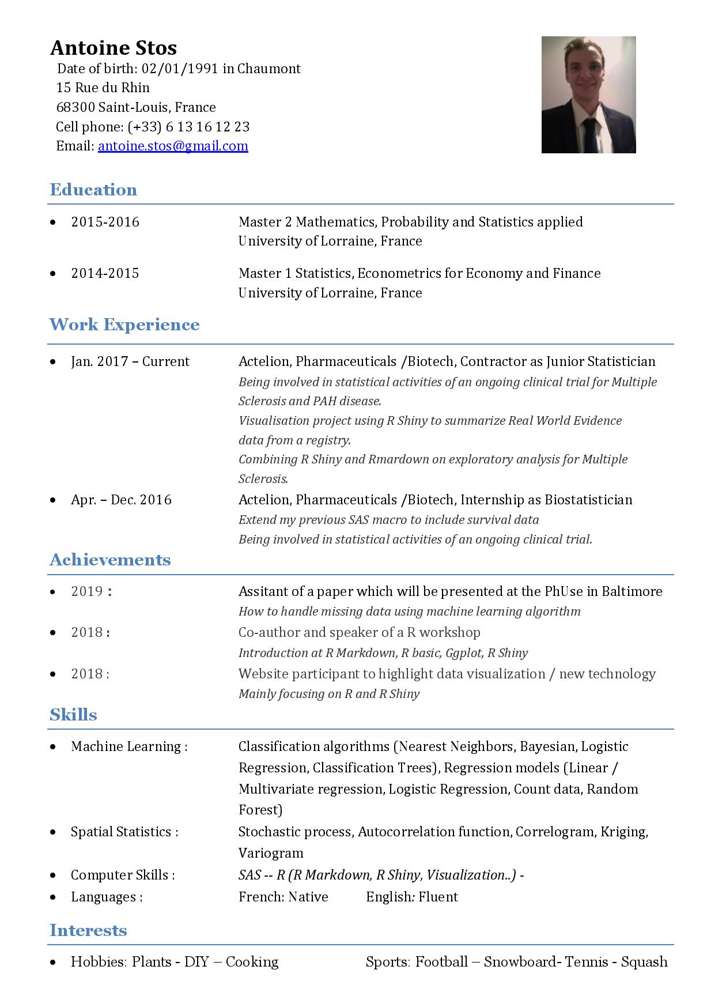

<style type="text/css">
.main-container {
  max-width: 1800px;
  margin-left: auto;
  margin-right: auto;
}
</style>

## Main page

```{r, echo= FALSE, warning= FALSE, message= FALSE}
library(ggplot2)
library(plotly)  
library(shiny)
library(imager)
library(magick)
library(readxl)
library(scales)
library(knitr)


#Comment

im<-load.image("image/Antoine.jpg")
r <- as.raster(im)

bv <- data.frame(var = c("Personal Profile",  "Hobbies", "Skills", "Achievements", "Work Experience", "Education", "Contact"), 
                 ymax = seq(10,70,10), 
                 ymin = seq(0,60,10), 
                 nbr = as.numeric(10))


output$var_grp_hist <-  renderPlotly({
p <- bv %>%
  plot_ly(labels = ~var, values = ~nbr, type = 'pie', key = unique(bv$var),
          textinfo = 'label',
          hoverinfo='none',
          hole = 0.6, 
          marker = list(colors = colors,
                        line = list(color = '#FFFFFF', width = 1)), 
          sort = TRUE) %>% 
  layout(showlegend = F,
         xaxis = list(showgrid = FALSE, zeroline = FALSE, showticklabels = FALSE),
         yaxis = list(showgrid = FALSE, zeroline = FALSE, showticklabels = FALSE), 
         images = list(
            source =  raster2uri(r),
            xref = "x",
            yref = "y",
            x = 1.7,
            y = 2.5,
            sizex = 2,
            sizey = 2,
            sizing = "stretch",
            opacity = 0.8,
            layer = "below"
        )
    ) %>% 
  config(displayModeBar = F)
})

output$profile <- renderUI({ 
      HTML(paste( h4("Personal Profile"), "<br>",
                  p("I have been working in Pharmaceuticals area for almost three years now. Started with an internship of three months,                      I had the chance to extend. I'm now working as a contractor as a Junior Biostatistician for Actelion."), "<br>",
                  p("Mainly interested in exploratory analysis using new kind of tools, data visualisation with R / R Shiny and Rmarkdown, and machine learning, I had the opportunity to work on very interesting projects dealing with PAH and Multiple Sclerosisd desease."), 
                  p("Data visualisation allow me to be creative, bringing clarity to data and a bit a fun to work")))
  })

output$Contact <- renderUI({
  HTML(paste(h4("Contact"), "<br>",
             p(htmltools::tags$img(src = knitr::image_uri('image/Bon.PNG')),
             "Antoine Stos" ), "<br>", 
             p(htmltools::tags$img(src = knitr::image_uri('image/Loc.PNG')),
             "15 Rue du Rhin, 68 300 Saint-Louis"), "<br>",
             p(htmltools::tags$img(src = knitr::image_uri('image/Pho.PNG')),
             "+33 613 161 223") , "<br>",
             p(htmltools::tags$img(src = knitr::image_uri('image/Mail.PNG')),
             "antoine.stos@gmail.com")
  ))
})

output$Education <- renderUI({ 
      HTML(paste( h4("Education"), "<br>",
                  
                  strong("2009"), ": Scientific Bacalaureat", "<br>", 
                  em("High school Jean Mermoz, Saint-Louis"), "<br>",
                  
                  "<br>",
                  
                  strong("2014"), ": Bachelor Degree in Economics", "<br>",
                  em("University PEGE, Strasbourg"), "<br>",
                  
                  "<br>",
                  
                  strong("2015"), ": Master I Degree in Statistics and Finance", "<br>",
                  em("University of Lorraine, Metz"), "<br>",
                  
                  "<br>",
                  
                  strong("2016"), ": Master II Degree in Mathematics and applied statistics", "<br>",
                  em("University of Lorraine, Metz")
                  ))
  })

output$Expe <- renderUI({ 
      HTML(paste( h4("Work Experience"), "<br>",
                  
                  strong("2015"), ": 3 months internship at Acteleion Ltd as Biostatisticien", "<br>", 
                  em("Building a SAS macro to dichotomize continuous variables based on Logistic Regression and ROC curve."), "<br>",
                  
                  "<br>",
                  
                  strong("2016"), ": 9 months internship at Acteleion Ltd as Biostatisticien", "<br>",
                  em("Extend my previous SAS macro to include survival data with Cox model and Kaplan-Meier estimate."), "<br>",
                  em("Being involved in statistical activities of an ongoing clinical trial."), "<br>",
                  
                  "<br>",
                  
                  strong("2016 - Current"), ": Contractor as Junior Biostatisticien for Actelion Ltd", "<br>",
                  em("Being involved in statistical activities of an ongoing clinical trial for Multiple Sclerosis and PAH desease."), "<br>",
                  em("Doing lot of work in data visualisation using R Shiny to sumarise the OPUS Registry for PAH"), "<br>",
                  em("Combining R Shiny and Rmardown on exploratory analysis for Multiple Sclerosis")
      ))
                  
  })

output$Ach <- renderUI({ 
      HTML(paste( h4("Achievments"), "<br>",
                  
                  strong("2017"), ": Participation of a website about data vizualisation", "<br>", 
                  em("Group of 4 Statisticiens / Programmer to bring vizualisation in data analysis. Mainly focused on R and R Shiny "), "<br>",
                  
                  "<br>",
                  
                  strong("2018"), ": Co-author of a R workshop", "<br>",
                  em("During an offsite I was one of the presentator and author of a R workshop combining R basics, Ggplot and Shiny"), "<br>",
                  
                  "<br>",
                  
                  strong("2019"), ": Assitant of a paper which will be presented at the PhUse in Baltimore", "<br>",
                  em("How to handle missing data using machine learning algorithm"), "<br>",
                  em("We are comparing classical methods of missing data against differents methods of machine learning"), "<br>"
      ))
})
  
  output$Ski <- renderUI({ 
      HTML(paste(h4("Skills"), "<br>",
                  
                  p(strong("Machine Learning"), ": Classification algorithms (Nearest Neighbors, Bayesian, Logistic Regression,                            Classification Trees), Regression models (Linear / Multivariate regression, Logistic Regression, Count data, Random                     Forest)")
                  , "<br>", 
                  
                  p(strong("Spatial statistics"), ": Stochastic process, Autocorrelation function, Correlogram, Kriging, Variogram)")
                  , "<br>", 
                  
                  p(strong("Computer Skills"), ": SAS, R, R Shiny, R Markdown") 
                  ,"<br>",
                  
                  p(strong("Languages"), ": French : Native        English : Fluent") 
                  
      ))
                  
  })

  
  output$Hobb <- renderUI({
  HTML(paste(h4("Hobbies"), "<br>",
             p(htmltools::tags$img(src = knitr::image_uri('image/Nov.jpg'), width = "100px", height =                 "100px"),"Here is the SC Novartis Football team" ), "<br>", 
             p(htmltools::tags$img(src = knitr::image_uri('image/Baobab.jpg'), width = "100px", height =                 "100px"),"Here are some babies baobabs" ), "<br>",
             p(htmltools::tags$img(src = knitr::image_uri('image/Ski.jpg'), width = "100px", height =                 "100px"),"Time to time, snowboarding" )
            
  ))
})


fluidRow(
  column(6,
        renderUI({
          plotlyOutput("var_grp_hist")
        })
  ),

  column(6,
        renderUI({
          
          s <- event_data("plotly_click")
          
          if (is.null(s)){ 
            print("Please click on a box")
            
          } else if (s$key[[1]] == "Personal Profile") { 
               htmlOutput("profile")
          } else if (s$key[[1]] == "Contact"){ 
                htmlOutput("Contact")
          } else if (s$key[[1]] == "Education"){ 
                htmlOutput("Education")
          } else if (s$key[[1]] == "Work Experience"){ 
                htmlOutput("Expe")
          } else if (s$key[[1]] == "Achievements"){
                htmlOutput("Ach")
          } else if (s$key[[1]] == "Skills"){
                htmlOutput("Ski")
          } else if (s$key[[1]] == "Hobbies"){
                htmlOutput("Hobb")
          }
        })
  )
)

```

***

## Application {.tabset}

### Swimer Plot 

```{r, echo= FALSE, warning= FALSE, message= FALSE}

swim <- read_excel("Data/Swimer.xlsx") %>% 
  mutate(STDT1 = format(as.Date(STDT), "%m-%y"),
         EDDT1 = format(as.Date(EDDT), "%m-%y"))


swim$Event <- as.factor(swim$Event)

swim$Event <- factor(swim$Event, levels=c("Scientific Baccalaureate", "Bachelor Degree in Economics", "Leisure time",  "Master I in Statistics and Finance", "Internship as Stastisticien, Actelion" , "Master II Degree in Mathematics and Statistics", "Contractor as Statisticien, Actelion"))

renderPlot({
  p <- ggplot(data= swim %>% filter(!is.na(Start))) +
  geom_segment(aes(x = as.Date(STDT), xend = as.Date(EDDT), y = 2, yend = 2, colour=Event), size = 12) +
  scale_y_continuous(breaks = c(2), labels = "Antoine")  + 
  scale_x_date(name = "Date",
               breaks = c(as.Date(swim$STDT), as.Date("2019-01-01")),
               labels = date_format(format = "%b %y"),
               expand = c(0,0), 
               limits = c(min(as.Date(swim$STDT)) - 30, max(as.Date(swim$EDDT)) + 30),
               minor_breaks = NULL)  + 
  theme(axis.title.x=element_blank(), 
        axis.title.y=element_blank(), 
        axis.text.x = element_text(size = 11, angle=90, vjust=.5),
        axis.text.y = element_text(size = 12),
        legend.position="bottom", 
        legend.title=element_blank(),
        legend.text=element_text(size=11)) + 
  guides(color = guide_legend(override.aes = list(size = 4)))
p
}, width = 1000) 


```


### Curriculum Vitae


```{r, echo= FALSE, warning= FALSE, message= FALSE}
 
```

### Cover letter
